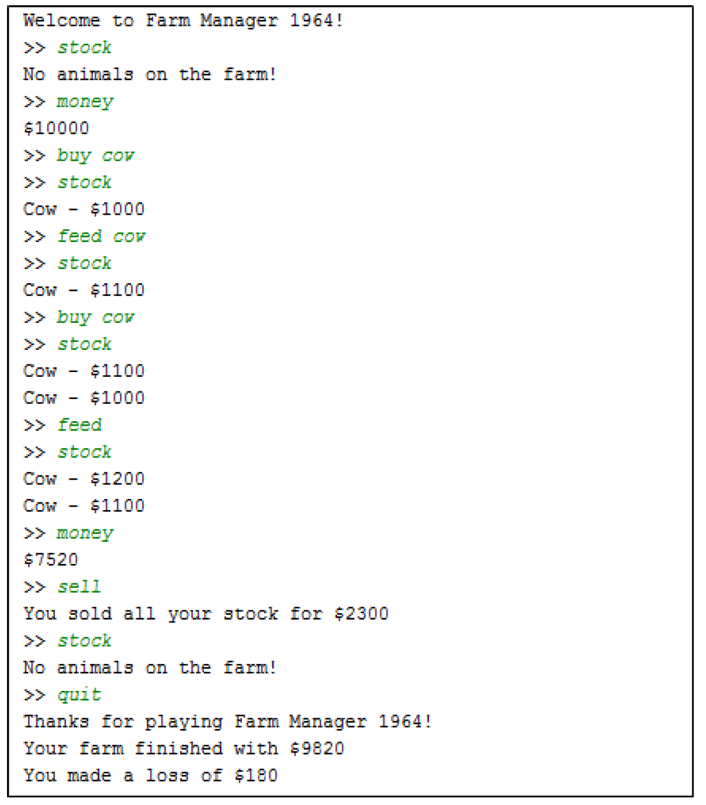
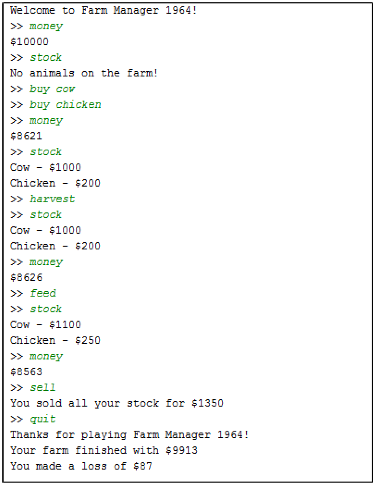

# Industry Lab: Abstraction and Inheritance


## Exercise One: Scanner and Printer
The following two interfaces specify the functions that a Document Scanner and a Printer are expected to have:

```java
public interface Scanner {
	public Document getDocument();
	public boolean jobsDone();
	public Error getError();
}
```
```java
public interface Printer {
	public void printDocument(Document d);
	public int getEstimateMinutesRemaining();
	public Error getError();
}
```

For the following two classes write down the methods that they must implement.

```java
public class PrintOmatic implements Printer {
	// TODO Implement the necessary methods
}
```
```java
public class OverpricedAllInOnePrinterfier implements Scanner, Printer {
	// TODO Implement the necessary methods
}
```

Which of the following lines are valid?
1. `Scanner eg2 = new PrintOmatic();`
2. `Printer eg3 = new OverpricedAllInOnePrinterfier();`
3. `OverPricedAllInOnePrinterfier eg4 = new Printer();`
4. `Printer eg1 = new Scanner();`


## Exercise Two: Simple Animal Class
The skeleton code is found in the `ictgradschool.industry.abstraction.pets` package.

The following interface specifies the functions that `IAnimal` is expected to perform:

```java
public interface IAnimal {
	// Returns a string containing the greeting
	public String sayHello(); 

	// Returns true or false;
	public boolean isMammal();

	// Returns the name, followed by "the" followed by the 
	// animal type, e.g. "George the Monkey"
	public String myName();

	// Returns the number of legs
	public int legCount();
}
```

Here is an example output of the application:

```text
Tweety the bird says tweet tweet.
Tweety the bird is a non-mammal.
Did I forget to tell you that I have 2 legs.
--------------------------------------------------------------
Bruno the dog says woof woof.
Bruno the dog is a mammal.
Did I forget to tell you that I have 4 legs.
--------------------------------------------------------------
Mr. Ed the horse says neigh.
Mr. Ed the horse is a mammal.
Did I forget to tell you that I have 4 legs.
This is a famous name of my animal type: PharLap
--------------------------------------------------------------
```

Complete the `Bird` and `Dog` classes that implement the interface `IAnimal`. Complete the `Horse` class that implements the interface 

`IAnimal` and another interface `IFamous` which will be used to tell the user about the famous kiwi horse `"PharLap"`.

```java
public interface IFamous {
	// What is a famous name for this animal
	public String famous(); 
}
```

Now create a simple application and call the method `processAnimalDetails(IAnimal[] list)` which iterates through an array of animals and gives the example output. Note that this method will call `myName`, `sayHello`, `isMammal`, and `legCount` for each one of the animals. We also like to print famous names of animals if they exist. `Hint: use instanceof operator.`

## Exercise Three: Farm Manager 1964
The skeleton code is found in the `ictgradschool.industry.abstraction.farmmanager` package.

### Introduction
In this game, you can buy animals, raise them, and sell them back for a profit. Just remember don’t run out of money!

Currently, the game has the following commands:
* `buy <animal name>` - buys new animals.
* `sell` - sells all your animals.
* `feed` - feeds as many animals as you have money for.
* `feed <animal type>` - feeds as many animals as you have money for that are of the given type.
* `stock` - lists which animals you have in stock.
* `money` - tells you how much money you have.
* `harvest` – harvests all animals that produce products.
* `quit` – provide a summary financial statement then exit the game.

Note that some commands will not work properly until you have implemented the required functionality.

### Task One. Complete Farm Constructor
Complete the constructor of the **Farm** class which takes an integer parameter in the Farm class so that:

 1. **money** is initialised to the given parameter.
 2. **STARTING_MONEY** is initialised to the given parameter.
 3.  **animals** array is initialised to hold 10 **Animal** objects.

### Task Two. Complete Farm’s buyAnimal method
The **buyAnimal** method in the **Farm** class allows users to buy animals for the farm. The purchase of an animal is only successful when:
 1. The animal type exists,
 2. The money is sufficient, and
 3. The animals array is not full, i.e. the array does not contain any null elements.

The first two conditions have been implemented in the **buyAnimal** method. Now, complete the method by implementing the third condition. Here is some pseduocode to help you to complete this method:

* Go through each element in the **animals** array
    * If the element is null, assign the newly created animal to that element. Deduct the price of the animal from the money you have for the farm. Then, return true.

### Task Three. Complete Farm’s feed method
Complete the **feed** method in the **Farm** class to feed all the animals of the specified type on the farm. An animal is only fed when there is enough money to feed it. When you fed an animal, you also need to subtract the cost to feed from the money you have on the farm, and call the feed method on the animal. Don’t forget to stop going through the **animals** array when there is no more animal to feed (i.e. when the animal becomes null)! 
<pre>Hint: You may use the <b>getType</b> method on the animal to get the animal type. Then, compare to see if the type of animal matches the one specified from the parameter. The match should be case insensitive.</pre>

### Task Four. Complete Farm’s printStock method
Complete the **printStock** method in the **Farm** class to print information for all animals on the farm by calling the **toString** method on each animal. If there are no animals on the farm, simply print the message "No animals on the farm!". 

 <pre>Hint: There are no animals on the farm if all elements in the <b>animals</b> array are null.</pre>

After completing these tasks, the **FarmManager** game should produce similar outputs as the following example: 



### Task Five. Create New Animals

*   Create a **Chicken** class, which extends the **Animal** class.
    1. Create a private constant **int** field, which stores 300. Name the field **MAX_VALULE**.
    2. Create a constructor for the **Chicken** class that does not take any parameters. Within the constructor, set the **value** for the chicken to 200.
    3. Implement the **feed** method so that the **value** for the chicken increases when the chicken has been fed. The formula for increasing the **value** is:    
        `value = value + (MAX_VALUE - value) / 2;`
	   Note that the **value** of the chicken should not exceed the **MAX_VALUE**.
    4. Implement the **costToFeed** method to return 3 as the cost for feeding each chicken.
    5. Implement the **getType** method to return "Chicken".
    6. Implement the **toString** method so that the user knows what it is. The String should be similar to the one in the **Cow** class.

*   Create a unique  type of animal, which also extends the **Animal** class. Implement the appropriate constructor and methods for your animal. Don’t forget to also implement an appropriate **toString** method on your animal.

*   Modify the **getAnimal** method in the **Farm** class appropriately to include **Chicken** and the animal type that you created in b).

### Task Six. Collect Products from Animals
Now, we would like to make some money by harvesting products from our animals. We want to be able to milk cows and collect eggs from chickens. In order to do so, you need to do the following steps:

 1. Modify the **Cow** class to implement the **IProductionAnimal** interface. A cow can only be milked if its value has reached the maximum. The money you can make from milking a harvestable cow is $20, otherwise $0.

 2. Modify the **Chicken** class to implement the **IProductionAnimal** interface. You can always collect eggs from a chicken regardless of its value. The money you can make from collecting eggs is $5.

 3. Complete the **harvestAll** method in the **Farm** class so that you can make money by harvesting the products from all animals that implement the **IProductionAnimal** interface. You can only harvest an animal if it is harvestable. If the animal is harvestable, use the **harvest** method on the animal and add the money made from harvesting to the **money** you have on the farm.

    <pre>Hint: use instanceof to determine if an animal is an instance of <b>IProductionAnimal</b>.</pre>

After completing all tasks, the **FarmManager** game should produce similar outputs as the following example:




# Challenges
These exercises are extension material for you to work on once you've completed all other lab exercises. If you don't get round to them during the lab, that's OK. In that case, it's a good idea to come back to them later on in the course, once you're more comfortable with the course content.

**Note:** Support from tutors / instructors on these questions is extremely limited, as their focus will be on assisting students with the preceding exercises.


## Challenge Exercise Four: Supermarket Inventory
This exercise is adapted from McAllister, W., & Fritz, Jane. (2015). Programming fundamentals using JAVA: A game application approach.

Create an application for a supermarket inventory system. A supermarket has five categories in its inventory. These categories are: Produce, Meat, Deli, Bakery, and Cleaning. Every product in the supermarket has a name, a base price, and a quantity in stock. Each product under Produce, Meat, Deli or Bakery category has an expiry date and a weight in kgs. Each product under the Deli or Bakery category also has an indication of whether the product is suitable for vegan or not.

The supermarket inventory system has another class called `LocalStore`. The `LocalStore` class contains information about the name, the location of the supermarket and the maximum number of products that the supermarket can store. It also has a list of inventory. Design and implement the `LocalStore` class that can do the following:

* Set the supermarket name
* Set the location of the supermarket
* Specify the maximum number of products that the supermarket can store
* Add a new product to the supermarket’s list of inventory
* Print information for all of the products stored in the supermarket
	* The information should include things like the product name, base price, quantity in stock
* Print information for the products under a particular category stored in the supermarket
	* The information should include things like the product name, base price, quantity in stock
	* The information should also include the category name, and any additional attributes such as expiry date

Create a start class which initialises an instance of the `LocalStore class`. This class allows the user to enter the initial inventory, and then repeatedly outputs the inventory:

 1. What is the name of the supermarket?
 2. What is location of the supermarket?
 3. What is the maximum number of products that the supermarket can store?
 4. Repeatedly present a menu to allow the user to select the generic category of a product and then request the information for that product until all information have been entered. Note that you should also provide an option to allow the user to see the list of products added, i.e. the menu described in item 5.
 5. Repeatedly present the user with the following menu until “q” is entered:
	* Enter 1 to output all the information for all of the products in the inventory
	* Enter 2 to output all the information for all of the products under a particular category
	* Enter 3 to add more products to the inventory
	* Enter q to quit the program

Note that if the user enters 2, the prompt should display more options for the user to choose the category of products. If the user enters 3, the prompt should return to item 4.


## Challenge Exercise Five: Advanced Polymorphism
1. What is the output when you run the following code?
```java
public class SuperClass { 
	public int x = 10; 
	static int y = 10; 

	SuperClass() { 
  		x = y++; 
	} 

	public int foo() { 
 		return x; 
	} 

	public static int goo() { 
 		return y; 
	} 
} 

public class Test1 extends SuperClass { 
	int x2= 20; 
	static int y2 = 20; 

	Test1() { 
 		x2 = y2++; 
	} 

	public int foo2() { 
 		return x2; 
	} 

	public static int goo2() {
 		return y2; 
	} 

	public static void main(String[] args) { 
 		SuperClass s1 = new SuperClass(); 
 		Test1 t1 = new Test1(); 
 		System.out.println("The Base object");  
 		System.out.println("S1.x = " + s1.x);  
 		System.out.println("S1.y = " + s1.y); 
 		System.out.println("S1.foo() = " + s1.foo()); 
 		System.out.println("S1.goo() = " + s1.goo());  
 		System.out.println("\nThe Derived object"); 
 	 	System.out.println("\nInherited fields");  
 		System.out.println("T1.x = " + t1.x); 
 		System.out.println("T1.y = " + t1.y); 
 		System.out.println("T1.foo() = " + t1.foo()); 
 		System.out.println("T1.goo() = " + t1.goo()); 
 		System.out.println("\nThe instance/class fields"); 
 		System.out.println("T1.x2 = " + t1.x2); 
 		System.out.println("T1.y2 = " + t1.y2); 
 		System.out.println("T1.foo2() = " + t1.foo2()); 
 		System.out.println("T1.goo2() = " + t1.goo2()); 
	} 
}
```
2. What is the output when you run the following code? The `SuperClass` will remain the same.
```java
public class Test1 extends SuperClass { 
 	static int x = 15; 
 	static int y = 15; 
 	int x2= 20; 
 	static int y2 = 20; 
 	
	Test1() { 
 		x2 = y2++; 
	} 

	public int foo2() { 
 		return x2; 
	} 

	public static int goo2() { 
 		return y2; 
	} 

	public static int goo(){ 
 		return y2; 
	} 

	public static void main(String[] args) { 
 		SuperClass s2 = new Test1(); 
 		System.out.println("\nThe static Binding"); 
 		System.out.println("S2.x = " + s2.x); 
 		System.out.println("S2.y = " + s2.y); 
 		System.out.println("S2.foo() = " + s2.foo()); 
 		System.out.println("S2.goo() = " + s2.goo()); 
	} 
}
```
3. To which class is the method `s2.goo()` called?

4. What is the static type of variable `s2`?

5. Are we able to make a call to method `foo2()` from variable `s2`?

6. What is the result from the following line of code?

   ```java Test1 t2 = new SuperClass();```

7. What is the result from the following line of code?

   ```java Test1 t2 = (Test1) new SuperClass();```
