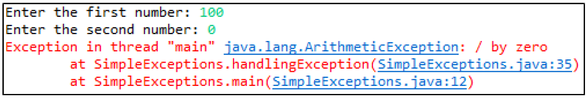
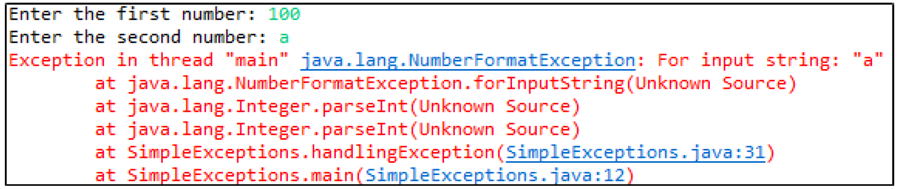

# Industry Lab: Exception Handling

## Exercise One: Try & Catch

1. What is the problem with the following code?
```java
private void tryCatch01() {
  int result = 0;
  int[] nums = null;
  try {
    result = nums.length;
    System.out.println("See you");
  } catch (ArithmeticException e) {
    System.out.println("Problem");
    result = -1;
  }
  System.out.println("Result: " + result);
}
```
```text


```

2. Rewrite the following code, adding an appropriate try-catch block to it:
```java
private void tryCatch02() {
  int num1 = 120, num2 = 120, result = 0;
  result = num2 / (num1 - num2);
  System.out.println("Result: " + result);
}
```
```text


```

3. Rewrite the following code, adding an appropriate try-catch block to it:
```java
private void tryCatch03() {
  int result = 0;
  String[] items = { "one", "two", null };
  result = items[2].length();
  System.out.println("Result: " + result);
}
```
```text


```

4. Correct the errors in the following code:
```java
private void tryCatch04() {
  try {
    int num = 0;
    System.out.println("Enter number: ");
    num = Integer.parseInt(Keyboard.readInput());
    System.out.println("Thank you");
  } catch (NumberFormatException e) {
    System.out.println("Input error");
    num = -1;
  }
  System.out.println("Number: " + num);
}
```
```text


```

5. Correct the errors in the following code:
```java
private int tryCatch05() {
  int result = 0;
  String[] nums = { 2, 3, 4, -1, 4 };
  try {
    result = nums[nums[3]];
    System.out.println("See you");
  } catch {
    System.out.println("Number error");
    result = -1;
  }
  return result;
}
```
```text


```

6. What is the output of the following code, when `tryCatch06()` is called?

```java
private void tryCatch06() {
  try {
    try06(0, "");
    System.out.println("A");
  } catch (ArithmeticException e) {
    System.out.println("B Error");
  }
}

private void try06(int num, String s) {
  System.out.println("C");
  try {
    num = s.length();
    num = 200 / num;
  } catch (NullPointerException e) {
    System.out.println("E Error");
  }
    System.out.println("F");
}
```
```text


```

7. In the code below, where should you put the try-catch if you always want the statement *System.out.println("C")* to be executed, even if there is an exception in the statement `num = s.length()` ?

```java
private void tryCatch07() {
 
  try07(0, null);
 
  System.out.println("A");
 
}
 
private void try07(int num, String s) {
  System.out.println("B");
 
  num = s.length();
 
  System.out.println("C");
}
```
```text


```

8. What is the output of the following code, when `tryCatch08()` is called?
```java
private void tryCatch08() {
  try {
    try08(0, null);
    System.out.println("A");
  } catch (NullPointerException e) {
    System.out.println("B");
  }
}
 
private void try08(int num, String s) {
  System.out.println("C");
  try {
    num = s.length();
    System.out.println("D");
  } finally {
    System.out.println("E");
  }
  System.out.println("F");
}
```
```text


```

9. What is the output of the following code, when `throwsClause09()` is called?
```java
private void throwsClause09() {
  try {
    throws09(null);
    System.out.println("A");
  } catch (NullPointerException e) {
    System.out.println(e);
  }
  System.out.println("B");
}
 
private void throws09(String numS) throws NullPointerException {
  if (numS == null) {
    throw new NullPointerException("Null String");
  }
  System.out.println("C");
}
```
```text


```

10. What is the output of the following code, when `throwsClause10()` is called?

```java
private void throwsClause10() {
  try {
    throws10(null);
    System.out.println("A");
  } catch (ArithmeticException e) {
    System.out.println(e);
  } finally {
    System.out.println("B");
  }
  System.out.println("C");
}
 
private void throws10(String numS) throws NullPointerException {
  if (numS == null) {
    throw new NullPointerException("Bad String");
  }
  System.out.println("D");
}
```
```text


```


## Exercise Two: Revisiting the Guessing Game
In a previous Programming for Industry lab, we created a game where the user was required to guess an integer between 1 & 100 (inclusive). For this exercise, modify that game to take invalid user input into account. Specifically, your game should do the following:

* If the user types an integer less than 1 or greater than 100, tell them they typed a value out of a valid range, and get them to re-enter a valid guess.
* If the user types something that’s not an integer, tell them they should only enter numbers, and get them to re-enter a valid guess.

For this exercise, you may use either your own guessing game from the previous lab, or the example solution provided in the `ictgradschool.industry.exception.guessing` package as a starting point. If you want to use your own, then delete the example solution and replace it with your own code before starting this exercise.


## Exercise Three: Improving Rock, Paper, Scissors
Understand the given solution provided in the `ictgradschool.industry.exception.rock` package. Then, modify the game to take invalid user input into account. If the user enters any values you’re not expecting (i.e. something that doesn’t represent a choice of Rock, Paper, Scissors, or Quit), then inform them of their incorrect input and re-prompt them until they enter valid input.
In addition, modify the game so that users can type numbers corresponding to their choice, OR type the word corresponding to that choice. For example, to select Rock, a user could type “1”, or they could type “Rock” (ignoring case).


## Exercise Four: Simple Exceptions
1. The **SimpleExceptions** class in the `ictgradschool.industry.exception.simpleexceptions` package requests two numbers (a and b) from the user, and returns the division of these two numbers (a/b). When b is 0, the program crashes (division by 0):


   Modify **handleException()** to handle this exception in the **SimpleExceptions** class.

2. Extend the **SimpleExceptions** class to handle user inputs which are not numbers. Currently if the user enters alphabetic characters which are not digits the program crashes:



3. Write some Java code in the **SimpleExceptions** class that will throw a **StringIndexOutOfBoundsException**.

4. Write some Java code in the **SimpleExceptions** class that will throw an **ArrayIndexOutOfBoundsException**.

5. What is the output of the program on the following page? Explain **why** this is the output.

```java
public class SimpleExceptions2 {
 
  	public static void main(String[] args) {
         	SimpleExceptions2 exceptions = new SimpleExceptions2();
         	exceptions.question2();
  	}
 
  	public void question2() {
         	try {
               	System.out.print("1: ");
               	perform("3");
               	System.out.print("A ");
               	System.out.println();
 
               	System.out.print("2: ");
               	perform("0");
               	System.out.print("B ");
               	System.out.println();
 
               	System.out.print("3: ");
               	perform(null);
               	System.out.print("C ");
               	System.out.println();
 
               	System.out.print("4: ");
               	perform("");
               	System.out.print("D ");
               	System.out.println();
         	} catch (NullPointerException e) {
               	System.out.print("E ");
         	} catch (Exception e) {
         	  	System.out.print("F ");
         	}
  	}
 
  	private void perform(String input) {
         	try {
               	int length = input.length();
               	int num1 = Integer.parseInt(input);
               	System.out.print("A4 ");
               	int num2 = 100 / num1;
               	System.out.print("B4 ");
         	} catch (NumberFormatException e) {
               	System.out.print("C4 ");
         	} catch (ArithmeticException e) {
               	System.out.print("D4 ");
         	} finally {
               	System.out.print("E4 ");
         	}
         	System.out.print("F4 ");
  	}
}
```


## Exercise Five: Arrays & Exceptions
In the `ictgradschool.industry.exceptions.arraysandexceptions` package, **ArraysAndExceptions** class contains the beginnings of a program which should generate an array of five random integers. The program should then allow the user to enter an index, and should print out the element in the generated array at the supplied index. Complete the program by following these steps:

1. Complete the **generateArray()** method, which should generate and return the array of random numbers.

2. Create three new classes – **InvalidIndexException**, **IndexTooLowException**, and **IndexTooHighException**. These should all be checked exceptions (i.e. extend the **Exception** class).

3. Modify the **getArrayIndexFromUser** method so that it throws these three exceptions appropriately:

	* **InvalidIndexException** should be thrown when the user doesn’t enter an integer.
	* **IndexTooLowException** should be thrown when the user enters a number that’s too small to be a valid index.
	* **IndexTooHighException** should be thrown when the user enters a number that’s too large to be a valid index.

4. Handle these exceptions in the **start()** method appropriately. If one is caught, the user should be told of their error and be allowed to try again.


## Exercise Six: More Custom Exceptions
Write a simple program that accepts a string of at most 100 characters. The string can contain any sequence of words separated by one or more spaces. A word is defined as a sequence of characters and that the first character is a letter. For example, “hello” is a word, “A02” is a word. However, “2B5” is not a word. If the string contains valid words, then the program will print the string with only the first letter of each word. Here is an example output of the program:

```text
Enter a string of at most 100 characters: Hello World!
You entered: H W
```

In implementing your solution to this question, you should create two more custom checked exception classes: **InvalidWordException** and **ExceedMaxStringLengthException**. 
These should be used as follows:

   * If the string contains invalid words (see description above), then the program will throw a customized exception **InvalidWordException** and the program will stop.
   * If the string is more than 100 characters, the program will throw a customized exception **ExceedMaxStringLengthException** and the program will stop.


In addition, you should use good software design practices when writing your solution. For example, you should write several different methods for your program, to break the main problem up into smaller sub-problems to make things easier. Have a think about the kinds of methods you might have before you start. This will act as a guide.
