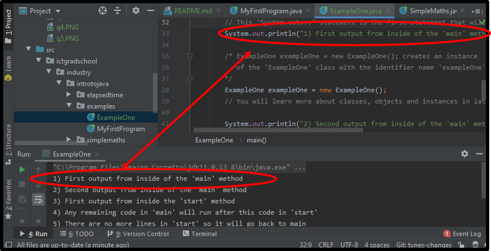
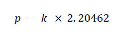
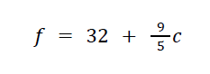
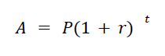
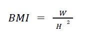
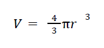

# Industry Lab: Introduction to Java

Download the .ZIP file for this lab and unzip it in a suitable directory on your computer. 

Follow the instructions carefully to open the project folder so that it functions correctly in your code editor. If it is configured correctly, you should be able to run the examples and exercises.

Detailed instructions for opening a project with IntelliJ are available in the [getting-started.md](getting-started.md) file contained in the project folder; please check these if you are unsure how to open the project correctly.

Note that in some later exercises, you are required to create a new Java project in IntelliJ. This will involve creating a new project within a new folder that is outside of the project folder used for earlier exercises.  

It is advised that you should download and install the 'Ultimate' version of IntelliJ [https://www.jetbrains.com/idea/](https://www.jetbrains.com/idea/) you can register to use it for free with an educational license if you use your university email [https://www.jetbrains.com/community/education/#students](https://www.jetbrains.com/community/education/#students)

## Examples directory:

This lab project contains and examples directory (`src.ictgradschool.industry.introtojava.examples`) which contains several classes that demonstrate various concepts from the lecture. It is suggested that you run these examples and view the output as a way of familiarising yourself with the concepts in the lecture.

## Exercise: Running a program and using `System.out...`

### Step 1) Running a program and observing the output

Open the `ExampleOne` class ( `src.introtobasics.examples.exampleone.ExampleOne` ) and familiarise yourself with its contents.

Read the notes within the comments in the class and think through them carefully.

Run the class by using one of the methods outlined above.

When you run the class, you should see the output of the `System.out...` statements within the `Run` window in IntelliJ.

It should look something like this:



This will often be lower down the screen but it can be moved and resized so it may not look exactly like the screenshot above. You may need to resize the `Run` window if it is too small.

Notice that the any text from within the quote marks inside the `Sytem.out...` statements is displayed in the `Run` window in the order that it was executed.

Examine the order of the statements and note that once the `start` method is called, all of the code within the `start` method will be executed before any remaining lines of code in the `main` method. It is important to understand the order in which the code will run especially when there are multiple methods in a program.

### Step 2) Writing your own `System.out...` statements

You can easily create your own `System.out...` statements by typing out the correct syntax: `System.out.println("...your text here...");`

Any statements and normal lines of code need to be added inside of the curly braces of a method inside a class. In `ExampleOne`, there are two methods: `start` and `main`; notice how all of the `System.out...` statements are within these methods. It is common to have more methods in a class and you can choose what you name them.

- HANDY TIP: A shortcut for creating a `System.out...` statement this is to type `sout` and IntelliJ will autocomplete the statement. IntelliJ has many handy shortcuts like this and we do not cover all of them so look up `IntelliJ shortcuts` or `IntelliJ tips` online.

Complete these steps:

- Create two new `System.out...` statements within the `ExampleOne` class. Create one inside the `start` method and one inside the `main` method. You can put any text/message you like inside these `System.out...` methods.

- Rerun your program and see if you can see the text from the `System.out...` statements inside the `Run` window. Make sure that you can see the new messages you wrote.
  
  - Tip: if your code does not run, check if there are any syntax errors in the code and that the `System.out...` statements are written inside the curly braces of the `start` or `main` methods.

### The out directory

After you have built/compiled and run your code, you will also see an `out` directory within your project.


The `out` directory will contain the compiled read-only files that are created based on the files in your `src` directory. The files within `out` will have identical filenames to the files within `src` but with some important differences:

- The files within the `src` directory have a `.java` extension and are the files in which you create and edit your code
- The files within the `out` directory have a `.class` extension and these are read-only files that are used to run our code

You should not normally need to view the contents of the `out` directory, but you can browse the `out` directory and view the files. In some code editors, you can see the contents of the files within the `out` directory as if they were normal Java files; however, it is important to understand that you cannot make changes to the code within the `.class` files in the `out` directory. When you want to make changes to your code, edit the code within the `.java` files within the `src` directory.


The `.class` files within the `out` directory are only created when you build/compile your code. Your code editor will automatically build/compile your code everytime you run it.

**<u>Note:</u>** many code editors like IntelliJ will hide the file extensions of the files within the `src` and `out` directories so it will not be immediately obvious that these are different file types if you are only viewing them within your code editor.

If you browse to the files within file explorer on your computer, it is easy to see the difference:


# Working with method calls and method definitions:

Open the `ExampleTwo` class (`src.introtobasics.examples.exampletwo.ExampleTwo`) and familiarise yourself with its contents.

Run the class and check that you can observe the output within IntelliJ.

This exercise is designed to help you trace and observe how the code moves through multiple methods in this example. The goal of this exercise is to develop a good understanding of how method definitions and method calls can structure the sequence of code that will run in your program.

There are four methods included in this example:

- main

- start

- exampleMethodOne

- exampleMethodTwo

You should see 10 console outputs in the console that come from different methods at different times. The numbers in the console outputs indicate the order in which the lines of code will be run.

Check that you have been able to run the class and view the output in the console. Observe the code and see if you can trace where the methods are being called from. Make sure that you have noted how the sequence of the code will return back to where a method was called from after method calls complete. Make sure you understand this well so you can predict how the code will behave when you add new method calls and method definitions to the code.

#### Adding a new method call to an existing method within the ExampleTwo class:

After you have examined and run the `ExampleTwo` class, try adding a second method call to `exampleMethodTwo` within `exampleMethodOne` after the last `System.out...` statement in the method.

Follow these steps if you are unsure how to do this:

- Create a new blank line inside of `exampleMethodOne` at the end of the method; this new line should be after the line of code that contains `System.out.println("8) We are now back in exampleMethodOne");` and before the closing curly brace that was on line 36.

- On you new blank line, add a method call to `exampleMethodTwo` ; the new method call should look exactly the same as the existing method call to the same method that is on line 34; i.e., it should look like this:  `exampleMethodTwo();`

Now try running the class again to see if the new method call will work.

#### Questions and extension tasks:

- Did the new method call work?

- Do you think there are any limits to how many times you can call an individual method?

- Could you also call `exampleMethodTwo` from within the `start` method? Add a call to `exampleMethodTwo` within the `start` to test whether you can

- Look at how the `start` method had to be called from within `main` compared to how the other methods were called outside of main. If you want to call other methods from within main, you need to do it in a similar way; e.g., `exampleTwo.exampleMethodOne();` . Try writing a method call like this within main and test whether it works. This may be confusing at this stage but this relates to differences between static methods and instance methods which we will learn about in later lectures.

## Exercise: Variables

In this exercise you will use some basic variables and `System.out...` to display the data from the variables to the console.

Open the `Variables` class ( `src.ictgradschool.industry.introtojava.variables.Variables` ).

Run `Variables.main()` to ensure that it is working correctly and that you can see the output of the existing `System.out...` statement in the console. You should see the text `The age is 0` in the console. 

Now observe the code and look at the variables that are present. There is an `int` called `age`, an `int` called `monthsSinceBirthday` and an `int` called `daysOnEarth`. These variables will be used in the next steps along with some other variables we will create. 

Complete these steps:

- Step 1) Add an age within the quote marks to the right hand side of the variable `age`
  
  - e.g.: `int age = 35;`
  - Run your code and check that you can see the age in the output; it should look something like this: `The age is 35`

- Step 2) Create a second `int` variable called `monthsSinceBirthday` and assign a number of months between 0-11 to it
  
  - e.g.: `int monthsSinceBirthday = 6;`

- Step 3) Create a `System.out...` statement that will output `monthsSinceBirthday` together with an appropriate mess; e.g., the output to the console could be: `Months since birthday: 6`

- Step 4) Now we will use the variables `age` and `monthsSinceBirthday` together to calculate the approximate days on earth of the user and store it in the variable `daysOnEarth`; follow these steps to complete this:
  
  - Make sure to add some values other than zero in for `age` and `monthsSinceBirthday`
  - Now for the variable `daysOnEarth` we can calculate the approximate days on earth with the formula: (age * 365) + (monthsSinceBirthday * 30)
  - To calculate this value and assign it to a variable we simply need to put this formula to the right-hand side of the `=` operator; for example: 
    - `int daysOnEarth = <your formula here>;`
    - This will assign the result of the formula to the `daysOnEarth` variable
  - Now create a final `System.out...` statement that will use the variable you created to inform the user approximately how many days they have been on earth; for example: `You have been on earth for 11770 days.`

Note: console applications can use `System.out...` as the main output to the user; however, using `System.out...` statements can also be useful to programmers while they are developing their code. You can use `System.out...` to output information at any particular point in the code. This can be useful to debugging code if you are not sure what a variable is at a particular point in execution. If you are stuck on any exercises, consider using `System.out...` to test if a variable contains the values you think it should contain.

If you do use output statements for debugging your code it is a good habit to delete them afterwards. There are also more advanced tools called debuggers that can be useful as an alternative to using `System.out...` for debugging. IntelliJ comes with a built-in debugger that can be very useful for stepping through your code and seeing what the values of all variables are set to at each step. It is suggested that you try using the debugger at some point; there are lots of resources online showing how the debugger in IntelliJ works. 

## Exercise: Methods with Math.max(...) and Math.min(...)

The following question makes use of the skeleton code found in:
`ictgradschool.industry.introtojava.methods.Methods`

In this exercise you will use the `Math.min(...)` and the `Math.max(...)` methods to get the maximum and minimum of two scores and output them to the console. 

There is some starter code and comments within the class you will use. 

- Step 1) One the line with `double highestScore = 0;`, change the `0` to a method call to the Math.max(...) method using the `p1Score` and `p2Score` as the arguments in the call to the Math.max() method; e.g., `Math.max(p1Score, p2Score)`
  - This will return the highest of the two variables and assign the returned value to the
    highestScore variable
  - When finished, run your code and check that the highestScore is output correctly to the console when the `System.out.println("The highest score is: " + highestScore);` line runs
- Step 2) Repeat the steps using `Math.min(...)` to return the lowest score and store it in a variable called `lowestScore` and then create a `System.out...` statement to display the `lowestScore` variable along with an appropriate message.

## Exercise: Casting

The following question makes use of the skeleton code found in:
`ictgradschool.industry.introtojava.casting.CastingExercise`

This exercise is a short exercise that is designed to practice casting.

The exercise involves modifying one line of code so that you can cast a variable of the data type double to a variable of the data type integer. 

When you cast a variable of a larger sized data type to a smaller sized data type, you will need to use parenthesise and the data type in front of the value. 

For example, to cast 3.5 to an integer, it would look like this: 

`int exampleInt = (int) 3.5;`

The value stored in `exampleInt` would be 3 because the data type `int` is a whole number with no decimal places.

We can do this with variables too, for example: 

```
double exampleDouble = 3.5;
int exampleInt = (int) exampleDouble;
```

With the two lines above the result will be the same as the earlier example; the value 3.5 is stored in a variable and then that variable is cast to an `int`.

#### Task:

- Within the class `ictgradschool.industry.introtojava.casting.CastingExercise`, complete the steps outlined within the 'TODO:...' comments to practice casting. 

## Exercise: Mathematics and order of operations practice

The following questions all make use of skeleton code found in:
    `ictgradschool.industry.introtojava.simplemaths.SimpleMaths.java`

To test your code, regularly run the unit test file, `TestSimpleMaths.java`, located in the test
folder. You can do this by right-clicking the file in IntelliJ and choosing `Run
TestSimpleMaths`. IntelliJ will give you a summary of which methods are currently passing or
failing.

Note: these mathematics exercises require you to understand the order of operations in relation to how the operations in the formula should be executed mathematically and how to ensure that this order is preserved when you structure the formulas in a programming language. Make sure to revise the lecture slides related to order of operations and lookup reference information in relation to the order of operations in mathematics if required.

Before completing each method in the `SimpleMaths` class, carefully examine the class and identify the flow of the program. You also need to think about these questions: 

- What are the identifier names and data types for the arguments of each method? 
- How should the computation be done in each method? 
- How is the output being displayed on the console after each method call? 
- What is the return type for each method?

### Exercises:

- Question 1: Complete the method called kilogramsToPounds() making use of the following
  formula where: p is the weight in pounds, and k is the weight in kilograms.



- Question 2: Complete the method called convertCelsiusToFahrenheit() making use of the following formula where: f is degrees Fahrenheit, and c is degrees Celsius. Hint: you’ll need to use the division ( / ) operator.



- Question 3: Complete the method called getCompoundInterestValue() making use of the following formula where: A is the future value of the investment including interest, P is the principal investment, r is the annual interest rate (remember to convert to decimal by dividing by 100), and t is the investment time in years. Hint: make use of Math.pow() method.



- Question 4: Complete the method called getMyBMI() making use of the following formula where: BMI is your body-mass index expressed as an integer, W is your weight in kilograms, and H is your height in metres.



- Question 5: Complete the method called getSphereVolume() making use of the following formula where: V is the volume in cubic centimetres rounded to an integer, r is the radius in centimetres, and π should use Java’s Math.PI constant variable. Hint: make use Math.pow() and Math.round() methods.



- Question 6: Complete the method called convertTotalDaysIntoWeeksAndDays() the purpose of which should be self-explanatory. Hint: you will need to make use of the divide ( / ) and modulus ( % ) operators.

- Question 7: Complete the method called findSmallerInteger() the purpose of which should be self-explanatory. Do not use if statements.

## Exercise: Using IntelliJ to create a new blank project

Many labs will use pre-made IntelliJ projects but for this exercise you will create a new blank project outside of the project folder used for earlier exercises. You must remember not to create new projects inside of existing IntelliJ projects so make sure you have a folder setup within which you can create IntelliJ projects.

Follow these steps to create a new project in IntelliJ: 

- Launch IntelliJ IDEA and create a new Java project
  - You can create a new project by selecting `File` &rarr; `New` &rarr; `Poject`
- Select the appropriate JDK from the Project SDK list
  - This will be the JDK that you downloaded as part of the software setup
  - You do not need to select any additional libraries or frameworks
- Don’t create a project from the template
- Select an appropriate project location on your computer and name the project
  `my-first-java-project`
  - You may want to create your own folder for lab exercises
- Click `Finish`

Once you have created the project, you can now create a new class.

- In the Project tool window, right click on the `src` folder, select `New` and then select
  `Java Class`
- Name the class `MyFirstProgram` and click `OK`
- You should now have the `MyFirstProgram` class in the Project tool window. Open
  the class and you should only have the following in the file:

```java
public class MyFirstProgram {
}
```

Now, add the following code to the class:

```java
public class MyFirstProgram {
    public void start() {
        System.out.println("Hello World");
    }

    public static void main(String[] args) {
        MyFirstProgram p = new MyFirstProgram();
        p.start();
    }
}
```

You can now compile and run the class by clicking on the green arrow icon next to the class
name.

### Questions:

1. What does this class do?
2. Where are the classes generated and stored by IntelliJ?
3. Where do you see the messages after running the program in IntelliJ?
4. What are the different ways of running this class in IntelliJ?
5. What are some of the useful shortcut keys you found in IntelliJ?

## Exercise: Add a New Class to an existing project

Using the `lab01` project you just created, create a new class called MySecondProgram in the
same folder as MyFirstProgram class. Copy the following code to MySecondProgram class:

```java
package ictgradschool.industry.introtojava.mysecondprogram;
public class MySecondProgram {
    public void start() {
        System.out.println("Hello World");
    }
}
```

Notice that you now have a compilation error associated with the package. Try to resolve the
error by using IntelliJ.

### Questions:

1. What happened to MySecondProgram class after you have fixed the error?
2. What are packages used for?

## Challenge Exercises

The exercises in this section are extension material for you to work on once you've completed all other lab exercises. If you don't get round to them during the lab, that's OK - these questions are more difficult than what you would expect to see in a test. In that case, it's a good idea to come back to these later on in the course, once you're more comfortable with the course content.

Note: Support from tutors / instructors on these questions is extremely limited, as their focus will be on assisting students with the preceding exercises.

### Challenge Exercise: Sorting Numbers

Complete the method sortNumbersByAscending() in SortNumbers.java. The code can also be found in SortNumbers.java. The method takes four integers as arguments and then displays them sorted into ascending order. Later in the course you will learn efficient ways of doing this using built-in methods, but for now use only methods you have learned in the lectures. Do not use if statements.

The skeleton code is found in:

`ictgradschool.industry.introtojava.sortnumbers.SortNumbers.java`

You may test your code by running the TestSortNumbers unit tests.

### Challenge Exercise: Calculate Elapsed Time

Complete the method getTimeElapsed() found in ElapsedTime.java. The method takes a start time and a finish time, each of which is broken down into hours and minutes and expressed as integers, and then displays the time difference between the two in minutes. You should assume a 12 hour period and that the start time is always earlier than the finish time; for example if the start time was 5 hours 30 minutes and the finish time was 5 hours 29 minutes, then 11 hours and 59 minutes must have passed. Do not use if statements for this exercise.

The skeleton code is in:

`ictgradschool.industry.introtojava.elapsedtime.ElapsedTime.java`

You may test your code by running the TestElapsedTime unit tests.
