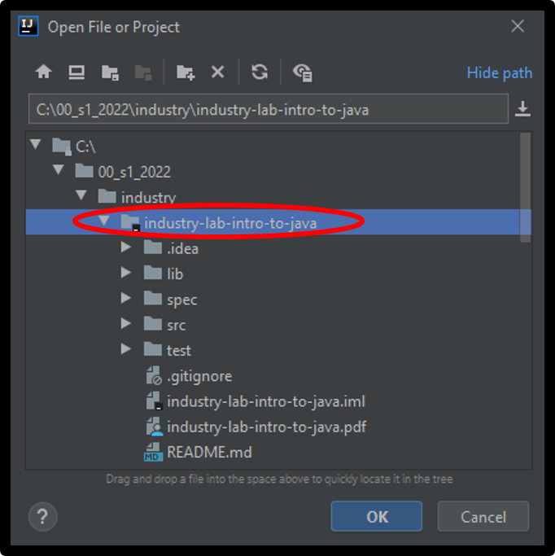
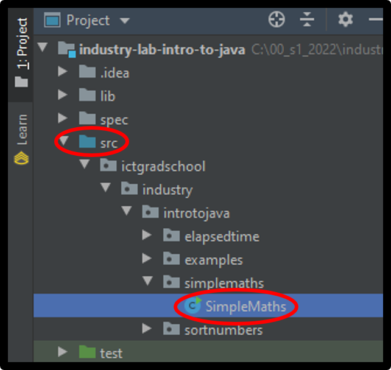
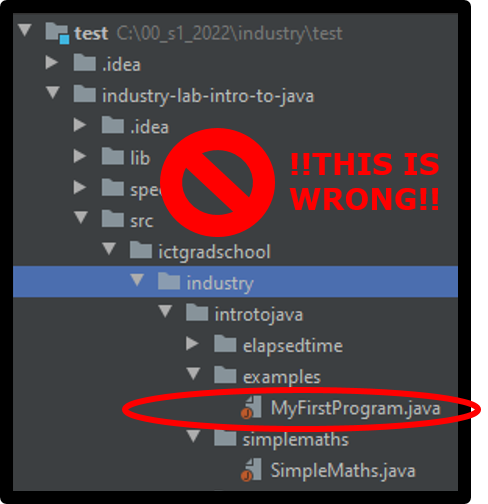
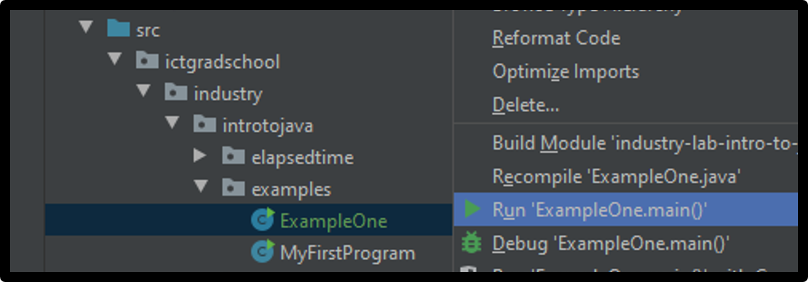
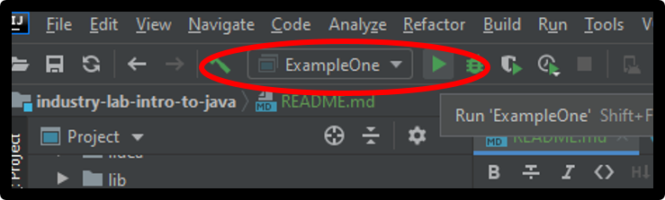

## Getting started: Opening, running and editing Java projects with IntelliJ

Java projects have a very specific structure that involves multiple folders and files.

If you do not open the project at the correct folder, you will not be able to properly run the code.

### Opening a Java project in IntelliJ

Make sure that you have downloaded and unzipped the lab project and know where it is located on your computer.

When you start-up IntelliJ you should have the option to open a project; you can also select open from `File` &rarr; `Open`.

It is very important for every project that you open the folder that contains the `src` folder:

You will notice that the folder has a black square in the bottom right indicating it is an IntelliJ project.

Opening this particular folder ensures that the project will be setup correctly to run the Java classes. If you accidentally open the wrong folder as the base of the project your Java code will not run.

### Checking the project is opened correctly

After you have opened the project, check that it is configured correctly.

Browse the files and folders of the project within IntelliJ.

The `src` folder should appear blue and there should be a green arrow visible on the runnable Java classes. Check that all runnable classes (classes with main methods) have green arrow in the top right corner.

If your `src` directory and Java classes look something like this image above, you have opened the project correctly.

If your Java classes ever look like this image below where the `src` folder is not blue and there is an orange circle on the Java classes, it indicates that the project has not been opened correctly. If this happens, you need to close the project and reopen the correct folder as described above.

### Running a program

Java classes that have a `public static void main(...)` method are able to be run; the green arrow on the top right corner of a Java class indicates this.

When you run a program, it will execute statements in the program in order and it may involve calling code in multiple methods that can be contained in multiple classes.

There are a couple of ways you can run Java classes in IntelliJ:

- One of the easiest ways is to right-click on the class you want to run and select `Run 'YourClassName.main()'`

- Alternatively, you can select and run the class from the menu at the top

If you use this approach, make sure to check that the class you are wanting to run is selected in the drop-down menu. 
