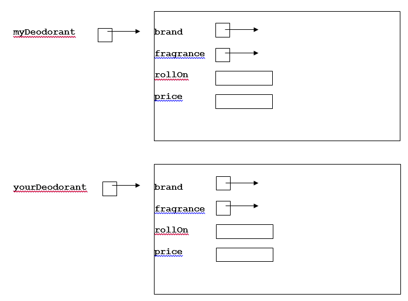
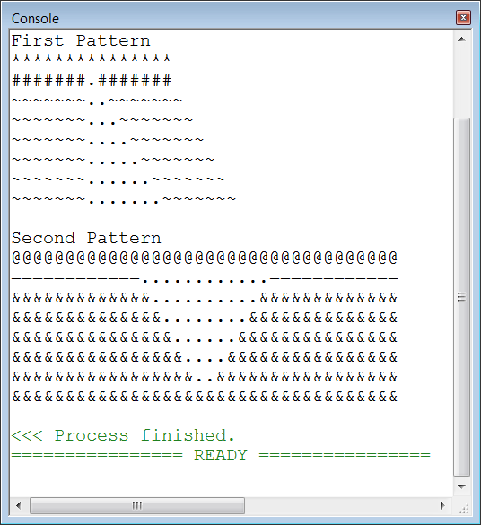
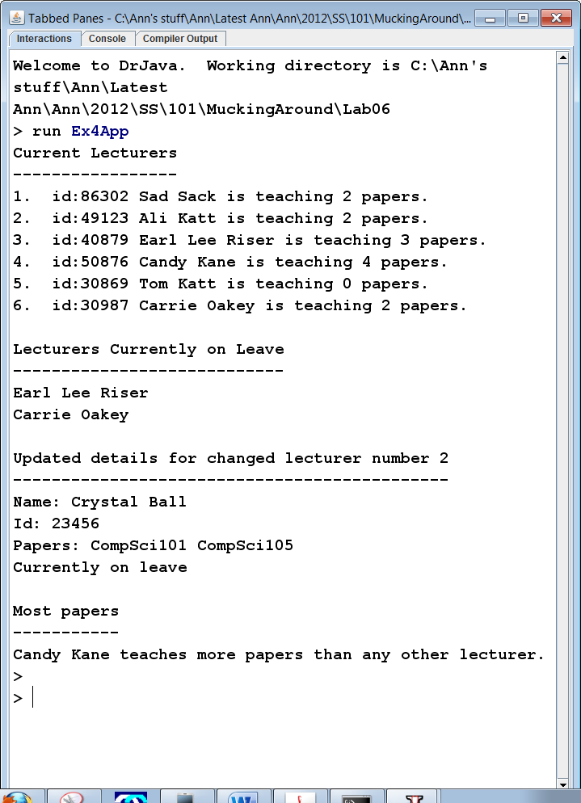
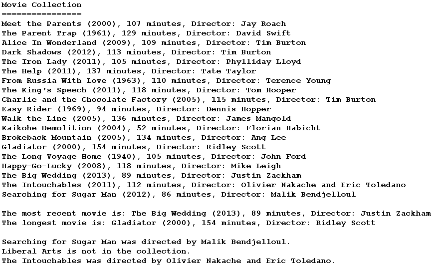

# Industry Lab: Java Classes

Note: there is also a written exercise available for this lab [here](written-questions.md). It is suggested that you start with the practical exercises in this lab. You may use the written exercise to revise the concepts in the lab after you have spent some time working on the practical exercises.

## Exercise One: The deodorant class
Below is the definition of the Deodorant class. The skeleton code is found in: `ictgradschool.industry.javaclass.deodorant.Deodorant.java`
```java
public class Deodorant { 
    private String brand;
    private String fragrance;
    private boolean rollOn;
    private double price;
    
    public Deodorant(String brand, String fragrance, boolean rollOn, double price) {
        this.brand = brand;
        this.fragrance = fragrance;
        this.rollOn = rollOn;
        this.price = price; 
    }

    public String toString() {
        String info = brand + " " + fragrance;
        if (rollOn) {
            info = info + " Roll-On";
        } else {
            info = info + " Spray";
        }
        info += " Deodorant, \n$" + price;
        return info;
    }
}
```

1. In the `Deodorant` class, complete the method definitions for 
   * the accessor methods `getPrice()`, `getBrand()`, `isRollOn()` and `getFragrance()` 
   * the mutator methods `setPrice()`, `setBrand()`, `setFragrance()` 
   * the boolean method `isMoreExpensiveThan(Deodorant other)` 
   
   Note: You can test your implementations using the supplied test class, `ictgradschool.industry.javaclass.deodorant.TestDeodorant`.

2. Two objects of type `Deodorant` are created as follows:
    ```java
    Deodorant myDeodorant = new Deodorant("Gentle", "Baby Powder", true, 4.99);
    
    Deodorant yourDeodorant = new Deodorant("Spring", "Blossom", false, 3.99);
    ```
    Complete the following diagram illustrating the values that are stored in the instance variables for each of these objects.  You should write very clearly on the diagram, as you are required to change the diagram when you complete part (3) of this question.
    
    
 3. Given the two `Deodorant` objects created and initialised as in the diagram above, give the output when the following statements are executed.
    
    **Note**: You MUST also mark any changes to the instance variables clearly on the diagram above.
    
    ```java
    System.out.println("1. " + myDeodorant.toString());
    
    myDeodorant.setBrand("Sweet");
    
    yourDeodorant.setPrice(5.29);
    
    System.out.println("2. " + yourDeodorant.toString());
    
    if (myDeodorant.isRollOn()) {
        System.out.println("3. Roll On");
    } else {
        System.out.println("3. Spray");
    }
    
    System.out.println("4. " + myDeodorant.toString());
    
    if (yourDeodorant.isMoreExpensiveThan(myDeodorant)) {
        System.out.println("5. Most expensive is " + yourDeodorant.getBrand());
    } else {
        System.out.println("5. Most expensive is " + myDeodorant.getBrand());
    }
    ```
    
## Exercise Two: The pattern class
The skeleton code is found in the `ictgradschool.industry.javaclass.printpattern` package.

Open the file `PrintPatternProgram.java`. This class creates an instance of the `Pattern` class and calls the methods in the `Pattern` class to print different patterns. 

The `Pattern` class defines a pattern.  It consists of 2 instance variables:  the pattern symbol and the number of repetitions of the symbol. Create the `Pattern.java` file and complete the class so that `PrintPatternProgram` can print the first pattern in the screenshot below.

**Hint #1**: You can create a new class in IntelliJ by right-clicking the package, and choosing New  Java Class. Name it `Pattern`.

**Hint #2**: Look at the code that’s commented out in PrintPatternProgram to see what methods your `Pattern` class needs to implement.

By calling the methods in the `Pattern.java` file, complete the `printPatternTwo()` method in `PrintPatternProgram` so that the second pattern is also printed, as in the screenshot below.  This method must create `Pattern` objects in a similar way to the `printPatternOne()` method.



## Exercise Three: The medals class
The skeleton code is found in the `ictgradschool.industry.javaclass.medals` package.

Complete the methods in the `Medals.java` file so that when the `DisplayMedalResults` is run it produces the following output:
```text
New Zealand has 4 gold medals, 12 silver medals, 13 bronze medals
Australia has 3 gold medals, 20 silver medals, 10 bronze medals
Canada has 6 gold medals, 5 silver medals, 7 bronze medals

Canada has the most gold medals
Australia is the overall winner
```
You need to write the following methods:
* The constructor
* The `toString()` method
* The `getCountryName()` method
* The `setCountryName()` method
* The `hasMoreGoldMedalsThan()` method

## Exercise Four: The mobile phone class
The skeleton code is found in the `ictgradschool.industry.javaclass.mobilephones` package.

Complete the `MobilePhone` class, and uncomment the marked lines in `DisplayMobilePrices.java` so that when `DisplayMobilePrices` is run, it produces the following output:
```text
Jonathan has an Apple iPhone 4 which cost $899.95
Ann has an LG Optimus-P970 which cost $699.95
Adriana has a Nokia N97 which cost $599.55
Alastair has now purchased a new Apple iPhone 4 for $899.95
Alastair has the same type as Jonathan
Adriana wants a new phone
```
You need to declare the 3 instance variables and write the following methods:
* The `MobilePhone()` constructor 
* The `getPrice()` and `setPrice()` methods
* The `toString()` method
* The `getModel()` and `setModel()` methods
* The `equals()` method
* The `isCheaperThan()` method

## Exercise Five: The lecturer class
The skeleton code is found in the `ictgradschool.industry.javaclass.lecturers` package.

Complete the `Lecturer` class and uncomment marked lines in `LecturerProgram.java` so that when `LecturerProgram` is run, it produces the output as per the screenshot below.

You need to write the following methods:
* The `Lecturer()` constructor
* The `getName()` and `setName()` methods
* The `getStaffId()` and `setStaffId()` methods
* The `getPapers()` and `setPapers()` methods
* The `isOnLeave()` and `setOnLeave()` methods
* The  `teachesMorePapersThan()` method
* The `toString()` method

Note:
1. You will need to check the `printLecturers()` method in the `LecturerProgram` class to see what needs to be done in your `toString()` method.
2. The instance variable `papers.length` will give you the number of papers that the lecturer takes.



## Exercise Six: Movies
The skeleton code is found in the `ictgradschool.industry.javaclass.movies` package.

Complete the code in `MovieProgram.java` as in Steps 1 - 5 below, so that it produces the following output when you run the code.


1. Declare and construct an array of 19 `Movie` objects. 
2. Write the `printMoviesArray()` method.  This method takes an array of `Movie` objects as a parameter and prints all the elements as per the screenshot above.  Note that the `toString()` method in the `Movie` class can be called to obtain a String containing the instance variables of a particular `Movie`, formatted in the required manner.
3. Write the `getMostRecentMovie()` method.  This method takes an array of `Movie` objects as a parameter and returns a reference to the most recent `Movie`. Note that the `isMoreRecentThan()` method in the `Movie` class can be used to determine if a `Movie` is more recent than another `Movie`.
4. Write the `getLongestMovie()` method.  This method takes an array of `Movie` objects as a parameter and returns a reference to the longest  `Movie`. Note that the `isLongerThan()` method in the `Movie` class can be used to determine if a `Movie` is longer than another `Movie`.
5. Write the `printDirector()` method.  This method takes 2 parameters: the name of a movie, and an array of `Movie` objects. The method should loop through the array searching for the movie with the name that has been passed in as a parameter.  If it finds a movie with that name, it should print out the director of the movie as per the screenshot above.  If it cannot find a movie with the name that has been passed in as a parameter, then it should print out `"not in the collection"` as per the screenshot above.