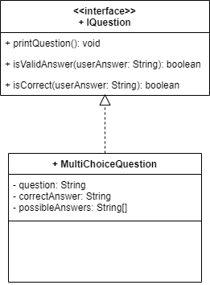
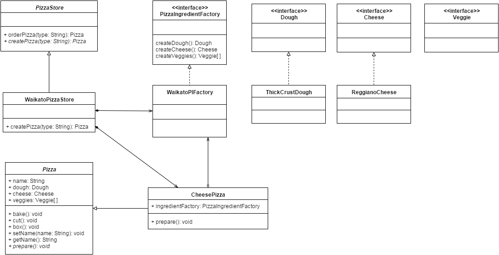

Industry Lab: More Practice
======
In today's lab exercises, you will be applying  the knowledge you have learned so far in this course to solve programming problems. You will also practise on building a simple application from scratch.  


## Exercise One: Quiz Maker
Use the skeleton codes found in `ictgradschool.industry.morepractice.quizmaker` when answering the following questions:

1. The following UML Class diagram provides you the basic structure of this exercise. Please study it before proceeding to the next step.

    
    
2. Create a new interface, called `IQuestion` (remember IJ shortcuts!). This will represent some kind of question to be answered by the user. When doing this, ask yourself:

   - What is an interface?
   
   - When is it a good idea to use interfaces?
   
3. `IQuestion` should define three methods:

   - `printQuestion()`: will print out the question to the user, so they know what they are being asked.
   
   - `isValidAnswer()`: Will take a `String` argument representing the user's answer. Will return `true` if and only if the given answer is valid (but not necessarily correct). For example, if the question is a maths problem, then "2", or "8.5" might be valid answers, but "Bob" is probably not.
   
   - `isCorrect()`: Will take a `String` argument representing the user's answer. Will return `true` if their answer is actually correct.

4. Let's make an implementation of that interface - call it `MultiChoiceQuestion`. This will represent a question with some number of possible answers, and the user should choose from one of those answers.

   - Use IntelliJ shortcuts to make yourself a skeleton implementation of this class, which we'll then fill in.

5. Create the constructor for `MultiChoiceQuestion`. At the same time, also create instance variables to store the data supplied in the constructor. The constructor should take the following arguments:

   - A `String` representing the question to ask the user
   
   - A `String[]` array representing the possible answers to the MCQ. Each element in the array would be a valid answer.
   
   - A `String` representing the letter of the correct answer.
   
   For example:
   
   - The first argument could be the String "What is 1 + 1?"
   
   - The second argument could be a String[] containing the elements "0", "2", "-7", and "Infinity".
   
   - The third argument could be the String "B", because B is the correct answer to the above question.
			  
6. Implement the `printQuestion()` method for `MultiChoiceQuestion`. This should print the question that was supplied in the constructor, and then each of the possible answers, along with the letter the user should type for that answer. For example, following on from the question above, this should print:

    ```text
    What is 1 + 1?
    A) 0
    B) 2
    C) -7
    D) Infinity
    ```
    
    HINT:
    ```java
    char letter = 'A';
    letter ++;
    System.out.println(letter); // This will print "B".
    ```

7. Implement the `isCorrect()` method for `MultiChoiceQuestion`. This should return true if the supplied answer string is the correct letter (ignore case).

   - Continuing from the previous example, the method should return true if the supplied answer is "B" or "b". Otherwise it should return false.

8. Implement the `isValidAnswer()` method for `MultiChoiceQuestion`. This should return true if the supplied answer string is any of the possible answer letters (ignore case)

   - Continuing from the previous example, the method should return true if the supplied answer is "A", "B", "C", or "D", or any of the lowercase equivalents. Otherwise it should return false.

    HINT:
    ```java
    char letter = 'C';
    if (letter >= 'A' && letter <= 'D') {
        System.out.println("Hello"); // This message will be printed.
    }
    ```

9. Create a new method in the `Main` class called `createQuestions()`.

    - This method should create a new `IQuestion[]` array, of length 5.
    
    - The method should then populate the array with five `MultiChoiceQuestion` instances (the contents of which are up to you!).
    
    - Finally, the method should return the array.

10. Add code to the `start()` method to complete the program. The code should do the following:

    1. Call the `createQuestions()` method to get the array of questions to ask.
    
    2. Loop through the questions array. For each question:
    
    3. Ask the question to the user
    
    4. Get the user's answer (use `Keyboard` class)
    
    5. Check whether the user has entered a valid answer (i.e. that the question's `isValidAnswer()` method returns true). If they haven't, prompt them to enter a new answer, and go back to iii.
    
    6. Check whether the user has entered a correct answer (i.e. that the question's `isCorrect()` method returns true). Print a message saying whether or not their answer was correct. If it was correct, add one to the user's score.
    
    7. After the questions loop, print a message similar to "You answered 3 out of 5 questions correctly".

    For this step, try and think about how you might extract different code into different *methods*, rather than having everything in the `start()` method.

11. Extend your work by adding a new type of question. For example: a `MathsQuestion` (where the result is a number), a `TrueFalseQuestion` (where the result is a boolean), or something else imaginative. Update the UML Class diagram to include your own question implementation.


## Exercise Two: Payroll Application
This application allows the payroll office of the Auckland Pizza Store to pay salary and bonus to their employees. Auckland Pizza Store has three types of employees, permanent, sales and seasonal employees. The salaries for different types of employees are calculated differently. The application will firstly show the employees' details and then generate their salary details.
 
In addition, Auckland Pizza Store did an amazing job selling lots of delicious pizzas for this year. CEO decides to pay bonuses to employees. However, only permanent and sales employees will receive the bonuses. Two different bonus schemes are used for permanent and sales employees. All permanent employees will receive a *fixed amount ($100.0)* as the bonus. All sales employees will receive *2% of their sales multiplied by commission* as the bonus.  

Finally, this application will compute the name of the most richest employee as a fancy feature.

Here is an example of the output of the application:

   ```text
     =====================================================
     Auckland Pizza Store has the following employees
     
     Andrew (ID: 1) is a permanent employee
     Brian (ID: 2) is a seasonal employee
     Cathy (ID: 3) is a sales employee
     David (ID: 4) is a permanent employee
     Emma (ID: 5) is a permanent employee
     Franky (ID: 6) is a sales employee
     Gill (ID: 7) is a sales employee
     Helen (ID: 8) is a seasonal employee
     Ian (ID: 9) is a sales employee
     James (ID: 10) is a seasonal employee
     Kevin (ID: 11) is a seasonal employee
     Lynda (ID: 12) is a permanent employee
     Michael (ID: 13) is a seasonal employee
     Nancy (ID: 14) is a seasonal employee
     Olivia (ID: 15) is a permanent employee
     Peter (ID: 16) is a permanent employee
     Queen (ID: 17) is a seasonal employee
     Richard (ID: 18) is a seasonal employee
     Steve (ID: 19) is a permanent employee
     Tyne (ID: 20) is a permanent employee
     
     =====================================================
     Payroll office is paying the salary.
     
     Andrew receives $120050.0
     Brian receives $15521.279999999999
     Cathy receives $120000.0
     David receives $100500.0
     Emma receives $60050.0
     Franky receives $36000.0
     Gill receives $221100.0
     Helen receives $17951.15
     Ian receives $90000.0
     James receives $20000.0
     Kevin receives $5000.0
     Lynda receives $54321.0
     Michael receives $12354.32
     Nancy receives $46000.0
     Olivia receives $77000.0
     Peter receives $63900.0
     Queen receives $16634.289999999997
     Richard receives $32010.0
     Steve receives $90000.0
     Tyne receives $100500.0
     
     =====================================================
     We have a great year. Let's share the fun!
     Bonus will be paid to permanent and sales employees.
     
     Andrew (ID: 1) is a permanent employee
     $100.0 bonus is paid
     Cathy (ID: 3) is a sales employee
     $2400.0 bonus is paid
     David (ID: 4) is a permanent employee
     $100.0 bonus is paid
     Emma (ID: 5) is a permanent employee
     $100.0 bonus is paid
     Franky (ID: 6) is a sales employee
     $720.0 bonus is paid
     Gill (ID: 7) is a sales employee
     $4422.0 bonus is paid
     Ian (ID: 9) is a sales employee
     $1800.0 bonus is paid
     Lynda (ID: 12) is a permanent employee
     $100.0 bonus is paid
     Olivia (ID: 15) is a permanent employee
     $100.0 bonus is paid
     Peter (ID: 16) is a permanent employee
     $100.0 bonus is paid
     Steve (ID: 19) is a permanent employee
     $100.0 bonus is paid
     Tyne (ID: 20) is a permanent employee
     $100.0 bonus is paid
     
     =====================================================
     The final salary balances:
     
     The balance of Andrew is $120150.0
     The balance of Brian is $15521.279999999999
     The balance of Cathy is $122400.0
     The balance of David is $100600.0
     The balance of Emma is $60150.0
     The balance of Franky is $36720.0
     The balance of Gill is $225522.0
     The balance of Helen is $17951.15
     The balance of Ian is $91800.0
     The balance of James is $20000.0
     The balance of Kevin is $5000.0
     The balance of Lynda is $54421.0
     The balance of Michael is $12354.32
     The balance of Nancy is $46000.0
     The balance of Olivia is $77100.0
     The balance of Peter is $64000.0
     The balance of Queen is $16634.289999999997
     The balance of Richard is $32010.0
     The balance of Steve is $90100.0
     The balance of Tyne is $100600.0
     
     =====================================================
     The richest employee in the company is: Gill
   ```

Use the skeleton codes found in `ictgradschool.industry.morepractice.payrollapplication` when answering the following questions:

1) Let's begin to work on `Employee` abstract class.

    1. Create the constructor for `Employee`. 
    
        - It should take the following 2 arguments: a `String` representing the name of the employee and a `String` representing the type of the employee and save the values to the instance variables.
           
        - Increment the static `count` variable by 1 and then set the `employeeId` to the new `count` value, so that the employeeId begins with 1.
        
    2. Create the getter methods for employee name, type and ID.
    
    3. Create an abstract method `salary()` which will return the employee's salary in `double` type.
    
    4. Implement the `toString()` method to provide the details of an employee. It should include employee's name, id and the employment type. An example looks like
    
        ```text
           Andrew (ID: 1) is a permanent employee
        ```
2) Now, create a `SalesEmployee` class which extends from `Employee` class.

    1. Declare two instance variables, `sales` and `commission` as `double`
    
    2. Create the constructor.
    
        - It has three arguments `name`, `sales` and `commission`.
        
        - It will call the parent constructor and passing in `name` from its argument and a String `"sales"` to represent the type.
        
        - Assign `sales` and `commission` arguments to the instance variables
        
    3. Implement the salary() method. The salary of sales employees can be calculated using the following formula: `salary = sales * commission`
    
3) Following similar steps as 2. to create `SeasonalEmployee` class, which also extends from `Employee` class.

    1. Declare two instance variables, `hours` and `wageRate` as `double`
    
    2. Create the constructor.
    
        - It has three arguments `name`, `hours` and `wageRate`.
        
        - It will call the parent constructor and passing in `name` from its argument and a String `"seasonal" `to represent the type.
        
        - Assign `hours` and `wageRate` arguments to the instance variables
        
    3. Implement the `salary()` method. The salary of sales employees can be calculated using the following formula: `salary = hours * wageRate`
     
4) Let's work on the `PayrollApp` class to generate some outputs.

    1. Create an `Employee` array with the variable name `employees` and call `createEmployees()` method to initialise the `employees` variable.
    
    2. Implement the `printEmployeeDetails()` method. This method should take an Employee array as the argument. It should print the employee details for all 20 employees to the console. Please refer to example output to see the message format. **Hint:** Take a look at the `toString()` method of the `Employee` class.
    
    3. Implement the `paySalary()` method. This method should take an `Employee` array as the argument. It will provide salary details of all employees, including names and salary amount. Your outputs should look the same as the example output.
    
5) You will need to implement the following methods on various classes in order to pay the bonus.
   1.  Create `payBonus()` method in the `PermanentEmployee` class. This method should take a fixed bonus amount as an input in `double` type.  This bonus is added to the `baseSalary` to update the salary balance and the bonus amount to be returned as `double`.  
   
   2. Create `payBonus()` method in the `SalesEmployee` class. This method should take a percentage (0.0 - 1.0) `bonusRate` as an input. 
   
      The formula to calculate the bonus amount is: 
        ```text
          bonusSale = bonusRate * sales 
          bonus = bonusSale * commission  
        ```  
      The `bonusSale` should be added to the `sales` to represent the new sales value. The bonus amount is to be returned as `double`. 
      
   3. Implement the `payBonus()` method in `PayrollApp` class. This method should check through all 20 employees and pay them the bonus according to the employment type. The employee details and the bonus amount should be printed at the console.
   
6) Write the `printBalance()` method. This method should take an `Employee` array as the argument. It will provide the balance of all employees, including names and salary amount. Your outputs should look the same as the example output.

7) There are two steps required to find the most richest employee in the company.

    1. Create `earnsMoreThan()` method in `Employee` class to compare the salary of two employees. This method should take another employee object as an argument and return a true/false value as a result. If the current employee earns more than the other employee, it should return true and vice versa.
    
    2. Implement the `getMostRichestEmployee()` method in `PayrollApp` class. This method should will take an employee array as an input argument and compare all the employees in the array to find the most richest employee by using the `earnsMoreThan()` method created above. This method will return the most richest employee object.
    
8) Create a UML class diagram based on your code. You must include all classes details and show their relationships.


## Exercise Three: Pizza Order Application
You will build a simple application from scratch for this exercise. Please put all Java classes for this exercise in `ictgradschool.industry.morepractice.pizzaorderapplication` folder.

1) This pizza order application displays the process of making a specific type of pizza from a specific store. The Waikato Pizza Store has one type of pizza, CheesePizza. The Waikato style cheese pizza uses reggiano cheese and has a thick crust. Use the UML class diagram below to implement the code. 

    

    In addition to the Java Classes shown in the UML diagram, you should also create a `PizzaOrderApp` Java class to make an order from the Waikato Pizza store. This application should produce the following output:

    ```text
    Preparing Waikato Style Cheese Pizza
    Thick crust dough is ready
    Reggiano cheese is ready
    Bake for 25 minutes at 350
    Cutting the pizza into diagonal slices
    Place pizza in official PizzaStore box
    -----------------------
    George ordered a Waikato Style Cheese Pizza
    ```

2) Now, create an Auckland Pizza Store and your own style pizza. Your pizza should have crust, cheese, and at least 2 different types of vegetables.

   After creating your own style pizza, you need to make an order for your own style pizza from the Auckland Pizza Store.

   Your final output should look similar to the following: 
    ```text
    Preparing Waikato Style Cheese Pizza
    Thick crust dough is ready
    Reggiano cheese is ready
    Bake for 25 minutes at 350
    Cutting the pizza into diagonal slices
    Place pizza in official PizzaStore box
    -----------------------
    Cameron ordered a Waikato Style Cheese Pizza
   

    Preparing Auckland Style Crazy Pizza
    Thin pan dough is ready
    Mozzarella cheese is ready
    Super HOT pepper is added
    Bake for 25 minutes at 350
    Cutting the pizza into diagonal slices
    Place pizza in official PizzaStore box
    -----------------------
    Yu-Cheng ordered a Auckland Style Crazy Pizza
    ```