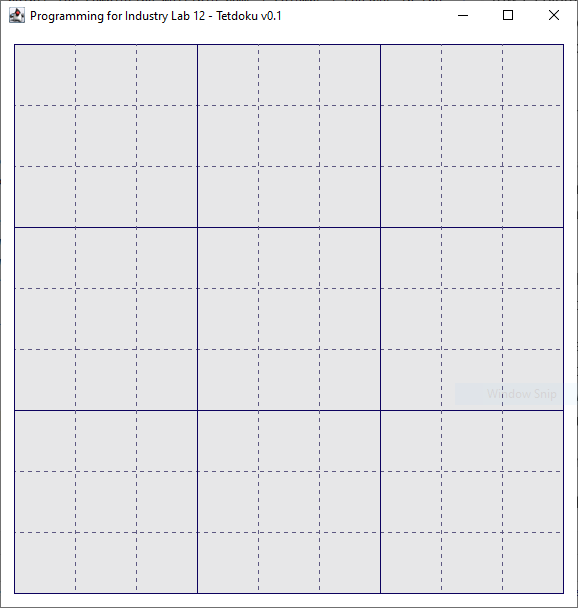
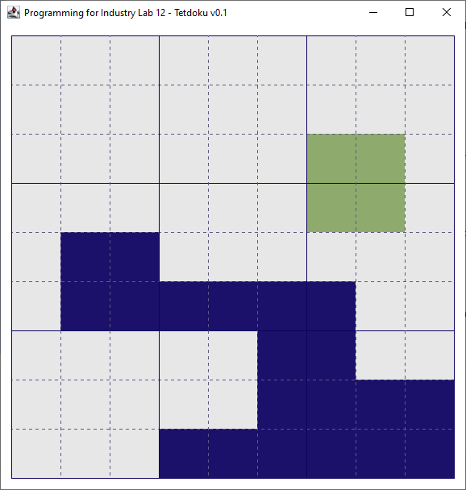
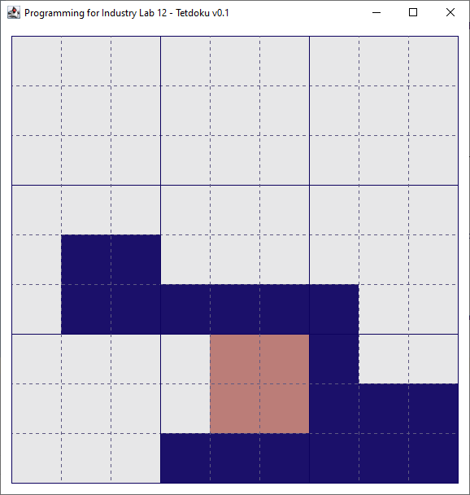
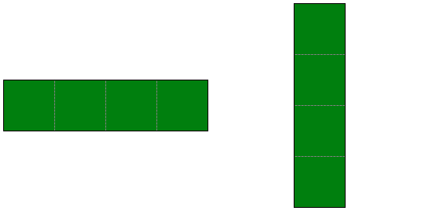
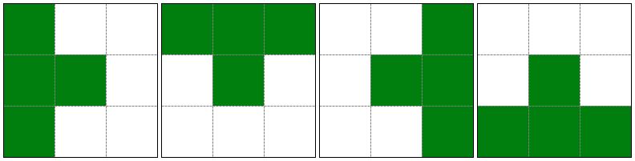

# Industry Lab - TetDoku 1

## About this lab
In today's lab, we will be modifying an existing application called Tetdoku. Tetdoku is a game in which players place [Tetris-style](https://en.wikipedia.org/wiki/Tetris) shapes onto a [Sudoku](https://en.wikipedia.org/wiki/Sudoku) grid. Players earn points by completely filling rows, columns, and "squares" on the Sudoku grid, and lose if they receive a Tetris shape which is impossible to place on the current grid. The game may be extended in a virtually infinite number of ways, limited only by the imagination. Examples include:

- Having players receive bonus points for completing multiple rows / columns / squares in the same move
- Adding "bonus" tiles to the grid which earn extra points when cleared
- Time trials
- Random modifications to the board mid-game
- Multiplayer
- Etc etc.

For today's lab, we'll be keeping things simple, and finishing our "Minimum Viable Product (MVP)". By the end of the lab:

- A single player will be able to place randomly generated shapes onto the grid
- Rows, columns, and squares will be cleared when completed
- There will be a visual aid which shows the player where they are trying to place shapes
- The visual aid will be color-coded based on whether the shape will fit in that location or not

We will return to Tetdoku in later labs to produce a more fully-functional game.

Examples of what the app will look like after completing today's lab are shown in these screenshots:

Figure 1: The blank Sudoku grid

Figure 2: A partially filled grid, trying to place a new square shape. The shape *can* be placed at the current mouse location, so it is shown *green*.

Figure 3: A partially filled grid, trying to place a new square shape. The shape *can't* be placed at the current mouse location, so it is shown *red*.

## Exercise One: Explore and model the app
When beginning to extend and modify an existing app of any reasonable size, one does not simply dive in and start coding! We need to first gain an understanding of the existing codebase, so we have a better idea of what we'll need to modify, and where we should add new code.

**Note:** An attempt has been made to use good software engineering practices to develop the existing app. However, *Best* practices for developing an event-driven GUI app have not exactly been followed - there is room for improvement here! We have achieved a reasonable *separation of concerns* between the app's *logic* and *visuals*, but in a later lab, you'll see how we can do even better using the *Model-View-Controller (MVC)* **design pattern**.

1. To begin, run the existing app! See what functionality is already provided, and what isn't, compared to the screenshots above. Make sure you move your mouse around on the grid, and click a few times. Try resizing the app window before / after clicking your mouse on the grid. Think about why you might have observed the behaviour that you did.

2. Next, create a UML class diagram using pen and paper, or the diagramming tool of your choice. You should include all classes / interfaces / enums in your diagram, and the appropriate relationships between them. You don't need to include every single method if you don't want to - just those which you feel are most important. But you should read each method's comments, and try to understand what things are doing as best you can. Don't be afraid to make additional code comments / journal notes / annotations on your UML diagram to help your memory and understanding.

3. While exploring the app and creating your diagram, answer the following questions to test yourself. If you can't figure out the answer, be sure to chat with your classmates / instructor / tutors about it before continuing to Exercise Two. Record your answers in your journal and / or by editing this `README` file:
   
   - What do I mean when I use the term "cell"? How many cells are in each row and column of a `GameBoard` instance when it is created using its default constructor?
   
   - What do I mean when I use the term "square size"?
   
   - How can I determine whether a particular shape will fit on a particular `GameBoard` at a particular location?
   
   - Under what circumstances is a `DoesntFitException` thrown?
   
   - How many different kinds of shapes have currently been implemented? What are they?
   
   - In your own words, explain what a shape's `isFilled()` method does?
   
   - What is the purpose of the enums in the `view.colorscheme` package?
   
   - What is the purpose of the various `...Painter` classes? Why do you think the functionality they provide has been separated from the `GameBoardPanel` class where they are used?
   
   - How is the gameboard able to be drawn at different sizes depending on how small or large the user's app window is? What are the key classes and methods involved with this functionality?
   
   - When a player clicks on the gameboard to try and place a shape, how does the game know which cell on the gameboard has been clicked?
   
   - Why is it that, when the player places a shape on the gameboard, the newly placed shape cannot be seen until the player resizes the app window? What could be done to fix this?
   
   - When a shape is placed on the gameboard, how does the game check whether any rows / columns / squares have been cleared? Does it actually clear them?
   
   - Why do the gameboard's grid lines look different to the screenshots above? What method in which class will need to be modified to fix this?

## Exercise Two: Bug fixing
As you will have noticed when playing around with the existing app, there are three bugs:

1. When the player places a shape on the gameboard, the newly placed shape cannot be seen until the player resizes the app window.

2. The gameboard's grid lines look different to those provided in the above screenshots. Specifically, all the grid lines are solid, whereas some are supposed to be dashed.

3. When a shape is placed on the gameboard, the game checks whether there are any rows / columns / squares that need to be cleared. However, nothing is actually cleared.

For your first modifications to the app, fix these bugs. Based on your exploration, modelling, and answering of the questions in Exercise One, you should have a reasonable idea of where the edits need to be made.

As you fix each bug, make sure to test your code to ensure that your fixes work.

**Hints:**

- How can we request that a Swing component redraws itself?

- What `GameLineStyles` are already defined, other than the one that's being used to draw the current grid lines?

- How can we determine which one to use for a particular line? Think about a gameboard's "square size", and what all the lines that are supposed to be drawn solid mathematically have in common in relation to this number, compared with those that are supposed to be drawn dashed.

- The game logic already helpfully creates a `List` of `CellArea`s representing all rows / columns / squares to be cleared. Use this list in your bugfix.

## Exercise Three: Random shapes
Another thing you'll notice is that, even though several subclasses of `TetdokuShape` have been defined, only one of them is ever actually used - i.e. every shape the user places is currently a  `SingleCellShape`. This kind of shape is great for testing our row / column / square clearing logic from Exercise Two, but doesn't lead to particularly fantastic gameplay! For this exercise, we'll randomize the shapes that the user can place, each time they place a new shape.

1. Begin by creating a new class in the `model.shapes` package, called `ShapeFactory`. Give it a single method, called `createRandomShape()`. This method should return either a `SingleCellShape`, a `LineShape` with a length of 4, or a `SquareShape` of size 2, with equal probability.

2. Add a new field to the `GameBoardPanel` class - an instance of your new `ShapeFactory` class.

3. Modify `GameBoardPanel`'s constructor to appropriately use your new class / method.

4. Modify the logic that allows the player to place shapes on the gameboard. After a shape has been successfully placed, the next shape to place should be randomized.

## Exercise Four: Mutating shapes
In a game of Tetris, as shapes are falling into place, a player can modify some shapes to better suit their needs. For example, a `LineShape` might be able to swap between vertical and horizontal states, as shown below. We will call this functionality *"mutation"*.

In this exercise, we'll add the ability for `TetdokuShape`s to mutate, and add the ability for the player to invoke this functionality by scrolling their mouse wheel.

1. Start by adding the mutation functionality. Add a new public method, called `mutate()`, to `TetdokuShape`. When doing so, consider whether `mutate()` should be defined as an `abstract` method, or whether it should simply be an empty method intended to be overridden in some subclasses. Justify your decision in your journal and / or by editing this `README`.

2. Override the `mutate()` method within the `LineShape` class to provide the functionality shown in the diagram above. If the shape is currently vertical, it should switch to horizontal, and vice versa. You will probably also need to modify `LineShape`'s `getSize()` method.

   **Hint:** One way of implementing this functionality is to add a `boolean` field to the shape, e.g. `isHorizontal`. Toggle that value in the `mutate()` method, and use that value in the `getSize()` method.
   
3. Now, let's add the ability for the player to invoke the `mutate()` method when desired, by scrolling their mouse. In Swing, we can register to be notified whenever the user scrolls their mouse over a component, by using a `MouseWheelListener`. Investigate the associated [Javadocs](https://docs.oracle.com/en/java/javase/11/docs/api/java.desktop/java/awt/event/MouseWheelListener.html), and implement a `MouseWheelListener` that will call the current shape's `mutate()` method whenever the player scrolls their mouse.

   **Hint:** To make this functionality easier to test, temporarily modify your `ShapeFactory` to *only* return `LineShape` instances (as these are the only shapes which currently can be mutated). Then, try scrolling the mouse wheel and see if the functionality works as expected. Alternatively or in conjunction, you may use appropriate `System.out.println()` statements.
   
   **Alternative:** If you're using a laptop, it might be more difficult to accurately control the "scroll wheel" of a touch pad. You are welcome to instead modify the existing `MouseListener` to *place* the shape if the player left-clicks, or *mutate* the shape if the player right-clicks. Or, you can use a `KeyListener` to bind the mutation functionality to a key on the player's keyboard.

## Exercise Five: Visual aids
After completing Exercises One through Four, the game is now playable - but it is difficult to play as the user can't see what the next shape looks like or where they are trying to place it! When the player's mouse is hovering over the gameboard, we want to be able to see what the next shape is, at the location where it will be placed should the player click the mouse. There are several steps to this process:

1. Create a `MouseMotionListener`. This kind of listener can detect when the mouse moves around over a Swing component, via its `mouseMoved()` method. Create and add to `GameBoardPanel` a `MouseMotionListener` whose `mouseMoved()` method is called whenever the mouse moves over the gameboard.

   **Hint:** Test this functionality (using e.g. `System.out.println()` statements) *before* moving on.

2. Add functionality to the `mouseMoved()` method which will figure out the gameboard cell the user is currently hovering over, if any. Create a field in `GameBoardPanel` called, e.g. `currentMouseCellCoords`, and update this value whenever it changes. You will also need to tell the panel to redraw itself.

   **Note:** Only tell the panel to redraw itself *if the current mouse cell coordinates actually change*, **not** every time `mouseMoved()` is called. This is for performance reasons (`mouseMoved()` is called every time the mouse moves by even a single pixel, and doing so will result in a lot of unnecessary painting).
   
   **Hint:** Investigate the already-implemented `MouseListener` to see how we can get the gameboard cell the user is currently hovering over.
   
3. Add code to `GameBoardPanel`'s `paintComponent()` method, *after* the gameboard cells are drawn, *before* the gridlines are drawn. Here, an appropriate `GameBoardShapePainter` should be created and used to paint the shape - but remember to check for possible `null` values first!

   **Hint:** The top-left of the shape shouldn't be drawn wherever the mouse is - but rather, the shape should be *centered* on the mouse. This can be achieved using the `getCurrentShapeCoords()` method - investigate how it is already being used when placing shapes. If you get this wrong, you'll notice: where the shape is rendered while hovering the mouse won't line up with where it actually ends up being placed!
   
4. Once steps 1 through 3 are complete, try mutating a shape. Does the shape change immediately? Or only when you move the mouse to a different cell? If you're not getting the immediate functionality you're looking for, add an extra `repaint()` call at an appropriate location within your code from Exercise Four.

## Exercise Six: Refactoring
Further investigate `SquareShape`, `LineShape`, and `SingleCellShape`. All three of these shapes are essentially rectangular shapes with some width and height, and all spaces within that shape's width and height are filled (i.e. there are no "empty" bits). When the shapes mutate, their width and height are swapped (though this is only noticeable currently on `LineShape`, as the other two shapes always have the same width and height). This is reflected in the fact that a lot of code is very similar - or identical - between the three classes.

1. In this exercise, create a `RectangularShape` class, which extends `TetdokuShape`, and implements the more general form of `SquareShape`, `LineShape`, and `SingleCellShape` as described here. The shape should take a `width` and `height` as constructor arguments, and should use its width and height in its `getSize()` and `isFilled()` calculations. For `RectangularShape`'s `mutate()` method, swap its width and height.

2. Modify `SquareShape`, `LineShape`, and `SingleCellShape` to extend `RectangularShape` instead of `TetdokuShape`. Remove all duplicated functionality - these three classes should now be extremely simple, consisting of only a constructor with appropriate arguments. The rest of the app should still work without modification once this change has been made.

## (Bonus) Exercise Seven: TeeShape
In this exercise, we'll add a new `TetdokuShape` subclass: a `TeeShape`. This is another classic shape borrowed from Tetris.

The shape has four possibilities, which are cycled through via its `mutate()` method, as shown here:

Once you've added the `TeeShape` class, modify your `ShapeFactory` so that it additionally may produce `TeeShape` instances. Then, test your game thoroughly to ensure all `TeeShape` functionality works as expected.  

## (Bonus) Exercise Eight: Add your own shape!
For the final exercise, add your own Shape to the game. This can be anything you like - perhaps another classic Tetris shape, or something completely new? The sky's the limit!
