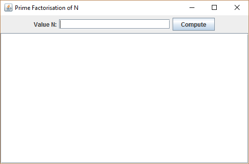
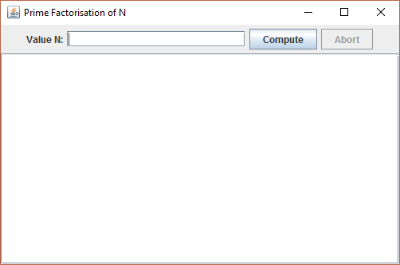

# Industry Lab: SwingWorker

## Exercise One: SwingWorker errors
For this exercise, examine the following code excerpt:

```java
public class AwesomeProgram implements ActionListener {

	private JLabel progressLabel = …;
	private JLabel myLabel = …;
	private JButton myButton = …;

	/** Called when the button is clicked. */
	@Override
	public void actionPerformed(ActionEvent e) {

		myButton.setEnabled(false);

		// Start the SwingWorker running
		MySwingWorker worker = new MySwingWorker();
		worker.doInBackground();

		// When the SwingWorker has finished, display the result in 
        // myLabel.
		int result = worker.get();
		myButton.setEnabled(true);
		myLabel.setText("Result: " + result);
	}

	private class MySwingWorker extends SwingWorker<int, Void> {

		protected int doInBackground() throws Exception {
			int result = 0;
			for (int i = 0; i < 100; i++) {

				// Do some long-running stuff
				result += doStuffAndThings();

				// Report intermediate results
				progressLabel.setText("Progress: " + i + "%");
			}

			return result;
		}

	}
}
```

There are **four errors** with the given code. For each error, state in detail what the error is, and what you would do to fix it.

**Note:** Assume that the **Swing** components have been created successfully, are displayed on the GUI correctly, that **doStuffAndThings** is a method that exists and performs some long-running task which returns an int, and that the **actionPerformed** method is called when the user clicks `myButton`.


## Exercise Two: Prime Factorization Swing App
In the previous lab, we developed a command-line program allowing the user to perform prime factorization of a number. In today’s lab, we’ll develop a responsive Swing application. We’ll develop the application in several steps.



Figure 1: Prime Factorization swing application

Initially, you’re provided with **SingleThreadedPrimeFactorsSwingApp**, which is a single-threaded version of the application we’ll be creating today. Open it, run it, and test it. For many values of *n*, the app appears to function well. However, when some values of *n* are used which take longer to factorize, the app appears to hang, which is poor usability. To see examples of such behaviour, try the following values for *n*:

- 999999999999989
- 10000001400000049
- 999999999999999989
- 9201111169755555649

For this exercise, we’ll start by moving the factorization process into a background thread using a **SwingWorker**, to provide better responsiveness.

Make a copy of **SingleThreadedPrimeFactorsSwingApp**, naming it **PrimeFactorsSwingApp**. Within class PrimeFactorsSwingApp, create a nested private class named **PrimeFactorisationWorker** that extends **SwingWorker**. Implement this class as appropriate such that the prime factorization calculation is now handled by the Swing framework using a background thread.

Using a **SwingWorker** class, the **ActionListener** for the Compute button should be modified. The handler should create a new instance of your PrimeFactorisationWorker class and call **execute()** on this object.

### Hints
A **PrimeFactorisationWorker** object needs to know the value of N for which it is to compute prime factors. Have PrimeFactorisationWorker maintain one instance variable to store the value of N, and have the constructor take a parameter for N.

For this exercise, keep the SwingWorker implementation simple. Don’t be concerned with making the SwingWorker cancellable or return intermediate results. The SwingWorker simply need to run so that in the background it computes the prime factors and returns them as a single final result. With, this in mind, implement **PrimeFactorisationWorker** as follows:

- For the generic type parameters, use **List< Long> for T** (the first type parameter for SwingWorker) and **Void for V** (the second type parameter). This means that the final result of the SwingWorker is a List of Long values (the prime factors) and that the SwingWorker does not return any intermediate results.
- Override **SwingWorker’s doInBackground()** method. The return type should be **List< Long>** (as specified for type T). This method can be implemented based on the code supplied in the Prime Factorization webpage. Recall that doInBackground() will be executed in a *separate thread*, managed by the *Swing framework*. It should not access any GUI components.
- Override **SwingWorker’s done()** method. Recall that this method is executed after doInBackground() by the *Event Dispatch thread*, and that it’s thus safe to access GUI components. This method should retrieve doInBackground()’s result via a call to **get()** and update the `JTextArea` component to show the computed values. This is also the place to re-enable the `Compute` button and restore the default cursor.


## Exercise Three: A Cancellable SwingWorker
For this exercise, we’ll further develop **PrimeFactorsSwingApp** so that the user can abort any ongoing computation. If you like, make a copy of PrimeFactorsSwingApp and rename it something else, such as **CancellablePrimeFactorsSwingApp**.

The GUI for the application should include an extra button, Abort, as shown below.



Figure 2: Addition of an Abort button which allows the user to cancel an in-progress factorization operation.

Similarly to lab 13’s exercise five step three, just as a **Runnable** object has to participate in the abortion process, so must a **SwingWorker** in a Swing application. Recall that SwingWorker includes a **cancel()** and an **isCancelled()** method. The ActionListener handler for the new Abort button should call **cancel()** on the SwingWorker. The **SwingWorker’s doInBackground()** method should check its cancelled status through an **isCancelled()** call, similarly to lab 13’s exercise five step three’s **run()** method checking the interrupted status of its thread.

### Hints
Declare the new Abort button, along with the Compute button, as an instance variable of the Swing application class. This way, it can be accessed by methods within both the application class and nested **PrimeFactorisationWorker** class. Method **done()** of **PrimeFactorisationWorker** should be responsible for changing the enabled/disabled status of the buttons  at the end of the computation.

Declare the **PrimeFactorisationWorker** object to also be an instance variable of the Swing application class (as opposed to a local variable within the `Compute` button’s **ActionListener**). This will allow the ActionListener for the Abort button to access the **SwingWorker** to cancel it.


## Exercise Four: Reporting Intermediate Results
The final refinement of the Swing application for computing prime factors involves having the SwingWorker produce intermediate results. For some values of N, the algorithm finds multiple factors over its execution. Rather than wait for all factors be found before presenting them on the GUI, this exercise involves making the SwingWorker report each factor as soon as it is found.

The GUI for this version of the application looks the same as that for exercise three. Make a copy of it and modify it as follows:

1. Change the V type argument from **Void** to **Long** to indicate that intermediate Long values (prime factors) will be generated.
2. In method **doInBackground()**, whenever a new prime factor is found, publish the new value.
3. Override method **process()** to update the `JTextArea` component with the new prime factor. Recall that this method is called by the *Event Dispatch thread*, and it is intended to update GUI components based on a partial result from the long running computation.
4. Change method **done()** – it no longer has to populate the `JTextArea` component because the prime factors have been added to the JTextArea as they’ve been found. **done()** simply needs to take care of setting the enabled/disabled status of the buttons and restoring the cursor.
